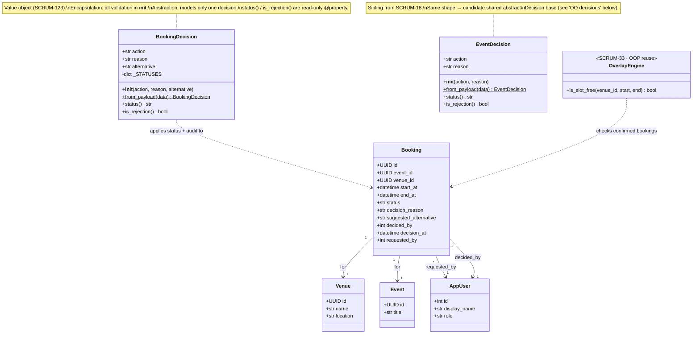
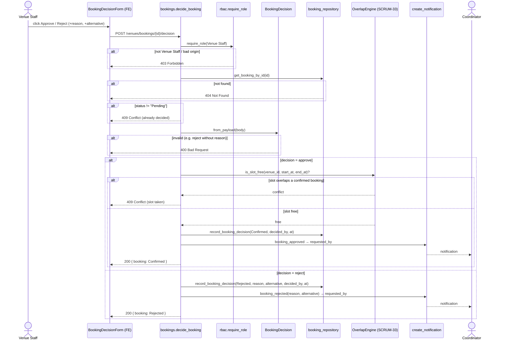

# SCRUM-32 — Booking Approval: C4 Code-level design

_C4 "Code" level (Week 5) for the booking-approval feature. Diagrams are kept as Mermaid
text so they diff in PRs and evolve with the code. Structure = class diagram; behaviour =
sequence diagram._

- **Story:** SCRUM-32 (Venue Staff approve/reject a submitted booking) · Epic SCRUM-6
- **Owner:** Marcus · **Consumes:** SCRUM-33 overlap engine (not implemented here)
- **Scope boundary:** the double-booking check is **SCRUM-33's OOP-reuse story**. This design
  *delegates* to it (an external call) and does **not** implement overlap logic here.

---

## 1. Class diagram (structure)



## 2. Sequence diagram (behaviour)

The failure branches are drawn as explicit `alt` fragments — Week 5's point that a sequence
diagram is the better spec when a story has ordering + failure paths. Note the ordering:
role → fetch → state guard → validate → (approve) overlap check → record → notify.



---

## 3. OO decisions (Week-13 accountability)

- **Encapsulation** — `BookingDecision` bundles the decision data with the rules that guard it:
  the constructor rejects an unknown action, requires a reason on reject, and trims/collapses
  blanks. Outside code can't build an invalid decision.
- **Abstraction** — it models *only* a decision (action, reason, alternative + derived status);
  it holds no persistence, so it's unit-testable in isolation (11 tests, SCRUM-123).
- **Why no inheritance (yet)** — `BookingDecision` and `EventDecision` share a shape, so a shared
  abstract `Decision` base (polymorphic `_STATUSES` / `status()`) is *possible*. It's deliberately
  **not** done: their status vocabularies and consumers differ, and Week 5 warns "reuse is a side
  benefit, not the point" — extracting a base now would be premature abstraction. Flagged here as
  a future option, not a commitment.
- **Association vs the engine** — overlap is a plain **delegation** to `OverlapEngine` (SCRUM-33),
  not inheritance/composition: booking approval *uses* the engine, it isn't *a kind of* it.

> [!note] Interim implementation vs this design
> This diagram shows the **agreed target** (overlap delegated to SCRUM-33). The current backend
> (SCRUM-121) uses the DB partial-`EXCLUDE` constraint as an **interim backstop** — it catches a
> `23P01` and returns 409. When SCRUM-33's engine lands, `decide_booking` calls it *before*
> confirming, and the DB constraint stays as defence-in-depth. Settle this split with Ernest/Jessica.
```
